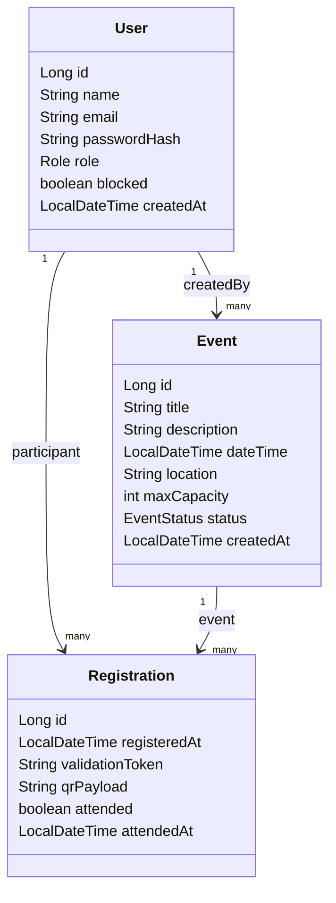

# Diagrama de clases (Mermaid)

```mermaid
classDiagram
  class User {
    Long id
    String name
    String email
    String passwordHash
    Role role
    boolean blocked
    LocalDateTime createdAt
  }

  class Event {
    Long id
    String title
    String description
    LocalDateTime dateTime
    String location
    int maxCapacity
    EventStatus status
    LocalDateTime createdAt
  }

  class Registration {
    Long id
    LocalDateTime registeredAt
    String validationToken
    String qrPayload
    boolean attended
    LocalDateTime attendedAt
  }

  User "1" --> "many" Event : createdBy
  User "1" --> "many" Registration : participant
  Event "1" --> "many" Registration : event
```
